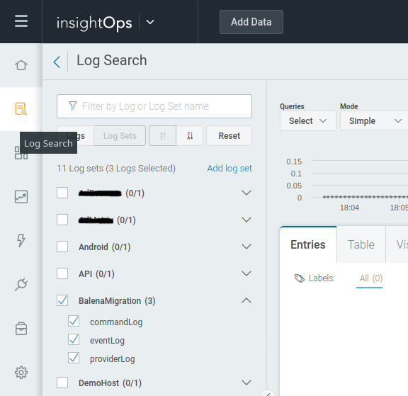
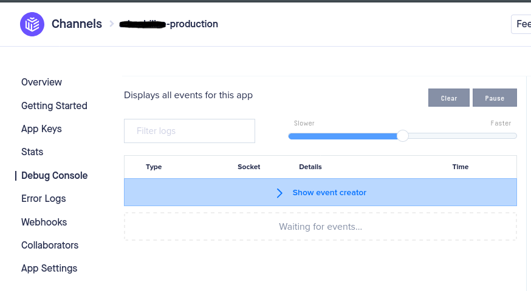
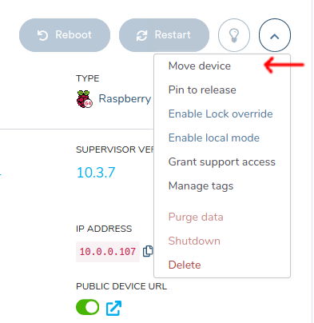

# Step by step guide to migration AdBeacons to BalenaOS

V20200703.1

## General sequence of process

All process is divided in three phases


* **PHASE 1: AdBeacon OS**
  
  In this phase, two scripts are run on the original AdBeacon operating system. The scripts are the __*diagnostic*__ and, the one that does the __*download of the images of BALENAOS and MIGOS*__ once all the downloads have been made, proceeds to __*install MIGOS*__ in the `/boot` partition. Once MIGOS is installed, the computer restart and phase 2 begins.

* **PHASE 2: MIGOS**

  In the second phase, when the computer restart automatically __*loads MIGOS in RAM*__, it copies the images downloaded from BALENA OS to RAM as well and starts the whole process of __*installing and configuring BALENA OS*__ in the SD of the device. Once this process finishes, the computer restart again.

* **PHASE 3: BALENA OS**

  In this last phase, the computer restarts with the new operating system, it automatically registers within the Balena cloud. Once registered, the user's own variables are registered, provisioning is made and finally the device is moved to the application within the Balena cloud.


## Prerequisites

There are two ways to do the entire migration process, one manual and the other automated, in each phase the two methods are explained.


For the **automated** process is necessary:

* An Ubuntu Linux 19.04 operating system is recommended, although in theory it also works on Windows and MacOS.

* Have the pusher client installed: [https://pusher.com/docs/channels/pusher_cli/overview](https://pusher.com/docs/channels/pusher_cli/overview)

* Have the balena client installed: [https://www.balena.io/docs/reference/balena-cli/](https://www.balena.io/docs/reference/balena-cli/)


For the **manual** process is necessary:

* Have access to pusher dashboard in `admobilize-production`: [https://dashboard.pusher.com/apps/367382](https://dashboard.pusher.com/apps/367382)

* Have access to balena dashboard in `BalenaMigration` App: [https://dashboard.balena-cloud.com/apps/1547294](https://dashboard.balena-cloud.com/apps/1547294)


For **both** process is necessary:

* Have access to `insightOps` dashboard: [https://insight.rapid7.com](https://insight.rapid7.com)
* Have the **ID** of the device to migrate, for example: `b8_27_eb_a0_a8_71` (with this device ID will be done all the examples in this document)


## How to see the Logs of the migration process

* Once you have accessed the `insightOps` dashboard in the` Log Search` section, select only the items referring to `BalenaMigration`




* To make the visualization more fluid it is recommended to select the option `Start live tail`

  

## Migration phase 1

### Automated (new way)

* Download the script `migPusher.sh` from: https://storage.cloud.google.com/balenamigration/migscripts/migPusher.sh

* Open one terminal, inside the directory where the previous script was downloaded an run the `migrate` event with the `device ID` to migrate, like this:

  ```./migPusher.sh cli b8_27_eb_a0_a8_71 migrate```

  In the dashboard of `insightOps` you can view the logs of the entire process.

### Semi-Automated (old way)

* Download the script `migPusher.sh` from: https://storage.cloud.google.com/balenamigration/migscripts/migPusher.sh

* Open one terminal, inside the directory where the previous script was downloaded, subscribe to the Pusher messages with the `device ID` to migrate, like this:

  ```./migPusher.sh cli b8_27_eb_a0_a8_71 subscribe```

* In another terminal exec:

  ``` ./migPusher.sh cli b8_27_eb_a0_a8_71 Diagnostic```  

  This will remotely run the **diagnostic script** on the specified device. The short result of this script can be seen in the console where the `subscribe` script is running.

  Additionally in the dashboard of `insightOps` you can view the logs of the entire process.

  If the result is **DIAGNOSTIC SUCCESS** you can proceed to execute the next script, if not, check the logs to see what was the error.

* In the same terminal where the diagnostic was run, execute the command for the installation script

  ```./migPusher.sh cli b8_27_eb_a0_a8_71 InstallMIGOS```

  As in the previous script, you can see the result of the script in the console where `subscribe` was executed and the log of the entire process in` insightOps`.

  If the result is successful, you will see **INSTALL MIGOS SUCCESS**

* Once the installation is successful, the device is restarted with:

  ```
  ./migPusher.sh cli b8_27_eb_a0_a8_71 reboot
  ```


### Manual way

* Log in to pusher dashboard into the `channel` of `admobilize-production` and to the `Debug Console` section

  


* Click in `Show event creator` and put the next info:

  In `Channel` the id of device: `b8_27_eb_a0_a8_71`

  In `Event` the word `request`

  In `Data` clear all and put this:

  ```
  {
    "command":"cd /tmp && wget https://storage.googleapis.com/balenamigration/migscripts/migDiagnostic.sh -O migDiagnostic.sh && wget https://storage.googleapis.com/balenamigration/migscripts/migDiagnostic.sh.md5 -O migDiagnostic.sh.md5 && md5sum --check migDiagnostic.sh.md5 && bash migDiagnostic.sh"
  }
  ```

  Click on `Send event`.

  The result of the command can be seen by looking for the response within the messages received on the same page taking into account the `device ID` of the device.

  Also, in the dashboard of `insightOps` you can also see the log of the entire process.

  If everything goes well, you should read the message **SUCCESS OF DIAGNOSIS**.


* To execute the installation script, click again in `Show event creator` and put the next info:

  In `Channel` the device ID: `b8_27_eb_a0_a8_71`

  In `Event` the word `request`

  In `Data` clear all and put this:

  ```
  {
    "command":"cd /tmp && wget https://storage.googleapis.com/balenamigration/migscripts/migInstallMIGOS.sh -O migInstallMIGOS.sh && wget https://storage.googleapis.com/balenamigration/migscripts/migInstallMIGOS.sh.md5 -O migInstallMIGOS.sh.md5 && md5sum --check migInstallMIGOS.sh.md5 && bash migInstallMIGOS.sh"
  }
  ```
  
  Click on `Send event`.
  
  The result of the command can be seen, looking for the answer within the messages received on the same page, taking into account the device's device ID.
  
  Additionally in the dashboard of `insightOps` you can also see the log of the whole process.
  
  If everything goes well, you should see the message **INSTALL MIGOS SUCCESS**.
  
  
* Once the installation is successful, the device should be restarted. To do this, click again on `Show event creator` and enter the following information:

  In Channel the device ID: `b8_27_eb_a0_a8_71`

  In Event the word `request`

  In Data clear all and put this:

  ```
  {
    "command":"[ ! -f /root/migstate/MIG_DIAGNOSTIC_IS_RUNING ] && [ ! -f /root/migstate/MIG_INSTALL_MIGOS_IS_RUNING ] && [ ! -f /root/migstate/MIG_RESTORE_RASPB_BOOT_IS_RUNING ] && reboot"
  }
  ```
  
  Click in `Send event`.


## Migration phase 2

This phase is fully automated, so there is no need to do any kind of intervention, just follow the entire process by reviewing the logs that the device generates in the `insightOps` dashboard.

In the logs of the process, **MIGOS SUCCESS SUPERVISOR** should be seen at the end, which indicates that the entire migration process of phase two concluded successfully. If all goes well, the computer will automatically restart and start phase 3.


## Migration phase 3

### Automated way

* For this phase it is necessary to download two files, one contains the information of the migrated devices `devices_migrated.csv` and the other is the script that configures those devices in the balena cloud `migProvider.sh`

  [https://storage.cloud.google.com/balenamigration/migscripts/devices_migrated.csv](https://storage.cloud.google.com/balenamigration/migscripts/devices_migrated.csv)

  [https://storage.cloud.google.com/balenamigration/migscripts/migProvider.sh](https://storage.cloud.google.com/balenamigration/migscripts/migProvider.sh)

* Once downloaded, the script runs without any argument, it connects to the balena cloud and scans for the migrated devices, once found, it will configure the new device automatically and move it to the final destination application.

  `./migProvider.sh`


### Manual way

* Log in to balena dashboard in the app `BalenaMigration`: [https://dashboard.balena-cloud.com/apps/1547294](https://dashboard.balena-cloud.com/apps/1547294)

* Once the migrated device appears, select it and proceed to the section `Device Variables`

  

* Here, the following 4 variables will be entered:

  `APPLICATION_ID` will have the value of `FACEV2`

  `PROJECT_ID` the value of `admobilize-testing`

  `DEVICE_ID` the same one that has been used but without underscores `b827eba0a871`

  And for the variable `PROVISIONING_TOKEN` search inside the file `devices_migrated.csv` the `deviceId` and its corresponding `deviceProvisioningToken`

* Once the variables have been entered, the device is moved to its final application. The rest of the provisioning and updating process will be done automatically.

  