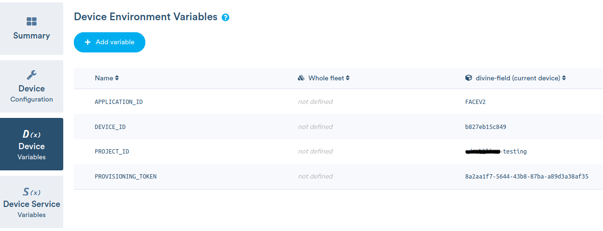

# Guía paso a paso para la Migración de AdBeacons a BalenaOS

V20200603.1

## Esquema general del proceso de migración

Todo el proceso se puede dividir es tres grandes fases


* **FASE 1: AdBeacon OS**

  En esta fase se corren dos scripts en el sistema operativo original del AdBeacon. Los script son el de __*diagnóstico*__ y, el que hace la __*descarga de las imágenes de BALENAOS y MIGOS*__ una vez hechas todas las descargas procede a  __*instalar MIGOS*__ en la partición `/boot`. Una ves Instalado MIGOS el equipo se reinicia e inicia la fase 2.

* **FASE 2: MIGOS**

  En la segunda fase el equipo al reiniciarse __*carga MIGOS en la RAM*__, copia las imágenes descargadas de BALENA OS a la RAM también e inicia todo el proceso de __*instalar y configurar BALENA OS*__ en la SD del dispositivo. Una vez este proceso finalice el equipo vuelve y se reinicia.

* **FASE 3: BALENA OS**

  En esta ultima fase el equipo reinicia ya con el nuevo sistema operativo, hace el registro automático dentro de la nube de Balena. Una vez registrado, se registran las variables propias de usuario, se hace el aprovisionamiento y finalmente se mueve el device a la aplicación dentro de la nube de balena.


## Prerequisitos

Hay dos formas de hacer todo el proceso de migración, uno manual y otro automatizado, en cada fase se explican los dos métodos. 

Para el proceso **automatizado** es necesario:

* Se recomienda un sistema operativo Ubuntu Linux 19.04, aunque en teoría también sirve en Windows y MacOS.

* Tener instalado el cliente de pusher: [https://pusher.com/docs/channels/pusher_cli/overview](https://pusher.com/docs/channels/pusher_cli/overview)

* Tener instalado el cliente de balena: [https://www.balena.io/docs/reference/balena-cli/](https://www.balena.io/docs/reference/balena-cli/)

  


Para el proceso **manual** es necesario:

* Tener acceso al dashboard de pusher en `admobilize-production`: [https://dashboard.pusher.com/apps/367382](https://dashboard.pusher.com/apps/367382)

* Tener acceso al dashboard de balena en `BalenaMigration`: [https://dashboard.balena-cloud.com/apps/1547294](https://dashboard.balena-cloud.com/apps/1547294)

  

Para **ambos** procesos es necesario:

* Tener acceso al dashboard de `insightOps`: [https://insight.rapid7.com](https://insight.rapid7.com)
* Tener el **ID** del device a migrar, por ejemplo: `b8_27_eb_a0_a8_71` (con este device ID se van a hacer todos los ejemplos de este documento)


## Cómo ver los Logs del proceso de migración

* Una vez accedido al dashboard de `insightOps` en la sección de `Log Search` seleccionar unicamente los items referentes a `BalenaMigration`


* Para hacer la visualización más fluida es recomendable seleccionar la opción `Start live tail`

  

## Migración Fase 1

### Forma Automatizada

* Descargar el script `migPusher.sh` desde: https://storage.cloud.google.com/balenamigration/migscripts/migPusher.sh

* En una terminal, dentro del directorio en donde se descargo el script anterior, suscribirse a los mensajes de Pusher con el `device ID` a migrar así:

  ```./migPusher.sh cli b8_27_eb_a0_a8_71 subscribe```

* En otra terminal ejecutar:

  ``` ./migPusher.sh cli b8_27_eb_a0_a8_71 Diagnostic```  

  Esto ejecutará remotamente el **script de diagnóstico** en el device especificado. La respuesta corta de este script se puede ver en la consola donde se ejecutó el script de `subscribe`.

  Adicionalmente en el dashboard de `insightOps` se pueden visualizar los logs de todo el proceso a medida que van sucediendo.

  Si el resultado es **DIAGNOSTIC SUCCESS** se puede proceder a ejecutar el siguiente script, si no, revisar los log a ver que fue lo que falló.

* En la misma terminal donde se ejecuto el diagnóstico se ejecuta ahora el comando para el script instalación

  ```./migPusher.sh cli b8_27_eb_a0_a8_71 InstallMIGOS```

  Al igual que en el anterior script se puede ver el resultado del script en la consola donde se ejecutó `subscribe` y el log de todo el proceso en `insightOps`.

  Si el resultado es exitoso se verá **INSTALL MIGOS SUCCESS**

* Una vez la instalación sea exitosa se reinicia el device:

  ```
  ./migPusher.sh cli b8_27_eb_a0_a8_71 reboot
  ```


### Forma manual

* Se ingresa al dashboard de pusher en el `channel` de `admobilize-production` y a la sección de `Debug Console`

  

  

* Se hace click en `Show event creator` y se ingresa la siguiente información:

  En `Channel` el id del device: `b8_27_eb_a0_a8_71`

  En `Event` la palabra `request`

  En `Data` se borra todo lo que esta, y se ingresa lo siguiente:

  ```
  {
    "command":"cd /tmp && wget https://storage.googleapis.com/balenamigration/migscripts/migDiagnostic.sh -O migDiagnostic.sh && wget https://storage.googleapis.com/balenamigration/migscripts/migDiagnostic.sh.md5 -O migDiagnostic.sh.md5 && md5sum --check migDiagnostic.sh.md5 && bash migDiagnostic.sh"
  }
  ```

  Se da click en `Send event`.

  El resultado del comando se puede ver buscando la respuesta dentro de los mensajes recibidos en la misma página teniendo en cuenta el `device ID` del dispositivo.

  Adicionalmente en el dashboard de `insightOps` también se puede ver el log del todo el proceso.

  Si todo sale bien debe verse el mensaje **DIAGNOSTIC SUCCESS**.

  

* Para el ejecutar el script de instalación, se hace click nuevamente en `Show event creator` y se ingresa la siguiente información:

  En `Channel` el id del device: `b8_27_eb_a0_a8_71`

  En `Event` la palabra `request`

  En `Data` se borra todo lo que esta, y se ingresa lo siguiente:

  ```
  {
    "command":"cd /tmp && wget https://storage.googleapis.com/balenamigration/migscripts/migInstallMIGOS.sh -O migInstallMIGOS.sh && wget https://storage.googleapis.com/balenamigration/migscripts/migInstallMIGOS.sh.md5 -O migInstallMIGOS.sh.md5 && md5sum --check migInstallMIGOS.sh.md5 && bash migInstallMIGOS.sh"
  }
  ```
  
  Se da click en `Send event`.
  
  El resultado del comando se puede ver, buscando la respuesta dentro de los mensajes recibidos en la misma página teniendo en cuenta el `device ID` del dispositivo.
  
  Adicionalmente en el dashboard de `insightOps` también se puede ver el log del todo el proceso.
  
  Si todo sale bien debe verse el mensaje **INSTALL MIGOS SUCCESS** .
  
  
  
* Una vez la instalación sea exitosa, se procede a reiniciar el dispositivo. Para ello se hace clic nuevamente es `Show event creator` y se ingresa la siguiente información:

  En Channel el id del device: `b8_27_eb_a0_a8_71`

  En Event la palabra `request`

  En Data se borra todo lo que esta, y se ingresa lo siguiente:

  ```
  {
    "command":"[ ! -f /root/migstate/MIG_DIAGNOSTIC_IS_RUNING ] && [ ! -f /root/migstate/MIG_INSTALL_MIGOS_IS_RUNING ] && [ ! -f /root/migstate/MIG_RESTORE_RASPB_BOOT_IS_RUNING ] && reboot"
  }
  ```
  
  Se da click en `Send event`.


## Migración Fase 2

Esta fase si es totalmente automatizada, por lo cual no hay necesidad de hacer ningún tipo de intervención, solamente hacer el seguimiento de todo el proceso revisando los log que el device genera en el dashboard de `insightOps`

En los logs del proceso, al final debe verse un **MIGOS SUCCESS SUPERVISOR** lo cual indica que todo el proceso de migración de la fase dos concluyó de forma satisfactoria. Si todo sale bien, el equipo se reiniciará de forma automática e iniciará la fase 3.


## Migración Fase 3

### Forma Automatizada

* Para esta fase es necesario descargarse dos archivos, uno es el que contiene la información de los dispositivos migrados `devices_migrated.csv` y el otro, es el script que hace la configuración de esos dispositivos en la nube de balena `migProvider.sh`

  [https://storage.cloud.google.com/balenamigration/migscripts/devices_migrated.csv](https://storage.cloud.google.com/balenamigration/migscripts/devices_migrated.csv)

  [https://storage.cloud.google.com/balenamigration/migscripts/migProvider.sh](https://storage.cloud.google.com/balenamigration/migscripts/migProvider.sh)

* Una vez descargados se ejecuta el script sin ningún argumento, este se conecta a la nube de balena y escanea en busca de los devices migrados, una vez encontrado, lo configurará de forma automática y lo mueve a la aplicación de destino final.

  `./migProvider.sh`


### Forma Manual

* Ingresar al dasboard de balena a la aplicación `BalenaMigration`: [https://dashboard.balena-cloud.com/apps/1547294](https://dashboard.balena-cloud.com/apps/1547294)

* Una vez aparezca el dispositivo migrado, se selecciona y se procede a ir a la sección de `Device Variables`

  

* Una vez allí, se van a ingresar las siguientes 4 variables:

  `APPLICATION_ID` tendra el valor de `FACEV2`

  `PROJECT_ID` el valor de `admobilize-testing`

  `DEVICE_ID` el mismo que se ha venido usando pero sin guiones bajos `b827eba0a871`

  Y para la variable de `PROVISIONING_TOKEN` buscar dentro del archivo de `devices_migrated.csv` el `deviceId` y su correspondiente `deviceProvisioningToken`

* Una vez ingresadas las variables, se procede a mover el dispositivo a su aplicación final. El resto del proceso de aprovisionamiento y actualización se hará de forma automática.

  